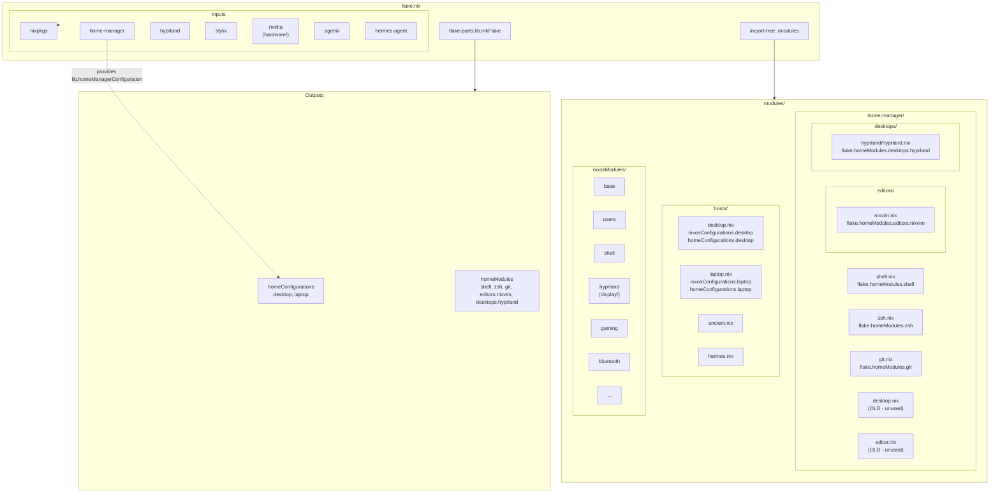
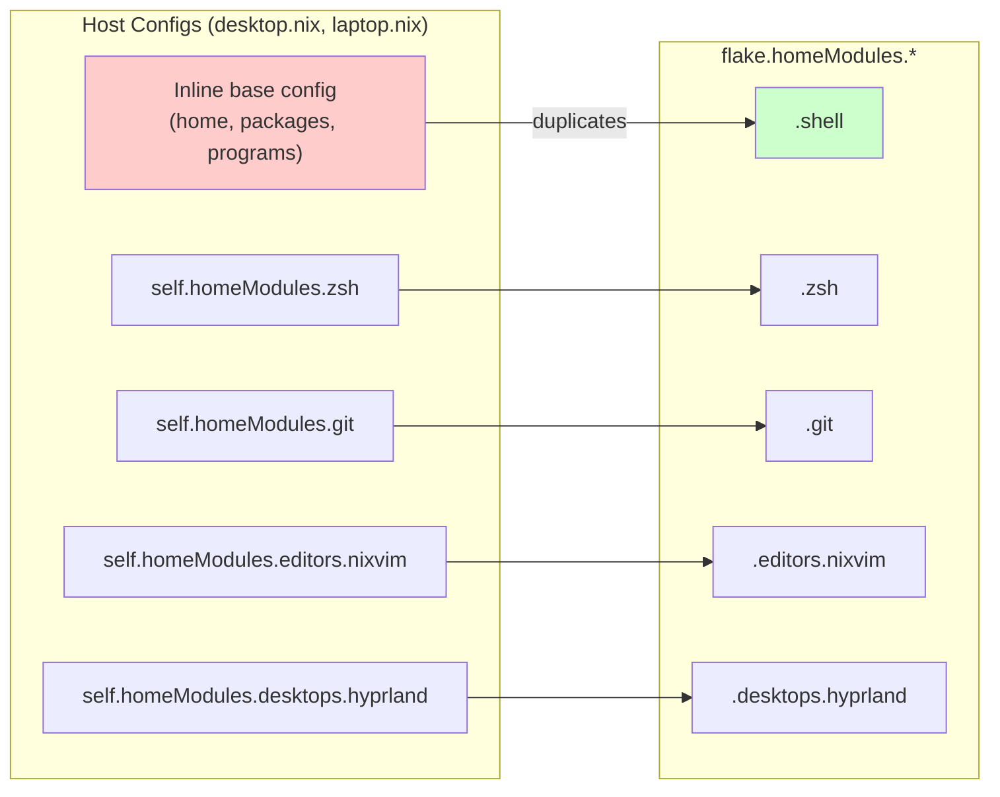
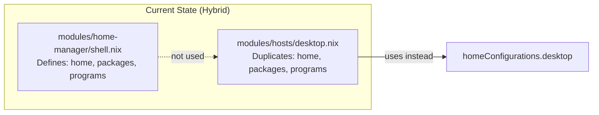

## Architecture Diagram

### Current Structure

```
┌─────────────────────────────────────────────────────────────────┐
│                         flake.nix                                │
│  ┌──────────────┐    ┌─────────────────────┐                  │
│  │   inputs     │───▶│  flake-parts.mkFlake  │                  │
│  │              │    │  + import-tree       │                  │
│  └──────────────┘    └──────────┬──────────┘                  │
│                                  │                              │
│  nixpkgs                        ▼                              │
│  home-manager          ┌─────────────────┐                     │
│  hyprland              │    modules/     │                     │
│  stylix                │                 │                     │
│  nixvim                │  ┌───────────┐  │                     │
│  agenix               │  │home-manager│  │                     │
│  hermes-agent         │  │  shell.nix │  │                     │
│                       │  │  zsh.nix  │  │                     │
│                       │  │  git.nix  │  │                     │
│                       │  │  editors/ │  │                     │
│                       │  │  desktops/│  │                     │
│                       │  └───────────┘  │                     │
│                       │                 │                     │
│                       │  ┌───────────┐  │                     │
│                       │  │  display/ │  │                     │
│                       │  │  hyprland │  │                     │
│                       │  ├───────────┤  │                     │
│                       │  │  gaming/  │  │                     │
│                       │  ├───────────┤  │                     │
│                       │  │  hardware/│  │                     │
│                       │  │  nvidia   │  │                     │
│                       │  │  bluetooth│  │                     │
│                       │  ├───────────┤  │                     │
│                       │  │   hosts/  │  │                     │
│                       │  │ desktop.nix│  │                     │
│                       │  │ laptop.nix│  │                     │
│                       │  └───────────┘  │                     │
│                       └─────────────────┘                     │
│                                  │                              │
└──────────────────────────────────┼──────────────────────────────┘
                                   ▼
                    ┌──────────────────────────────┐
                    │        Outputs              │
                    │  nixosConfigurations.*     │
                    │  homeConfigurations.*      │
                    │  homeModules.*              │
                    └──────────────────────────────┘
```

### Module Dependency Flow



### Current Issue: Duplication



### The Problem Summary

| File | Purpose | Issue |
|------|---------|-------|
| `modules/home-manager/shell.nix` | Dendritic module for base config | Defined but NOT used in hosts |
| `modules/hosts/desktop.nix` | Host config | Has DUPLICATE inline base config |
| `modules/home-manager/desktop.nix` | Old monolithic | Should be deleted |
| `modules/home-manager/editor.nix` | Old nixvim | Should be deleted |

### What Works vs What Doesn't

```
✅ WORKS:
  - NixOS configurations build correctly
  - flake.homeModules.* exports exist
  - import-tree auto-discovers modules
  - hosts can import self.homeModules.*

❌ DOESN'T WORK:
  - shell.nix module not used (duplicated inline)
  - homeConfigurations shows as "unknown" (Nix version)
  - "Self-enabling" pattern (each module imports base) fails
```
